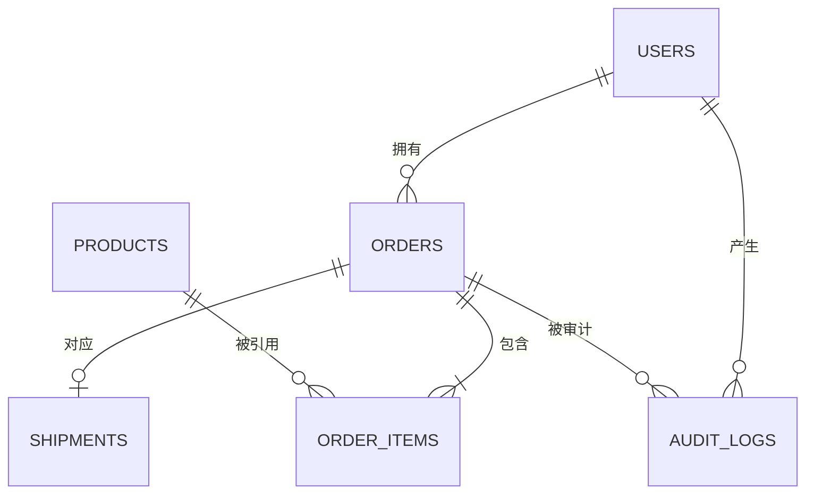

# V1 架构说明

## 设计目标

V1 先建立后续 LangGraph Agent 可以安全调用的电商业务基础。核心原则是：模型负责理解和判断，身份校验、数据库查询和权限控制由确定性代码完成。

```text
HTTP 请求
    -> JWT 鉴权，获取可信 user_id
    -> Tool 层（随业务 Agent 节点接入）
    -> Repository 接口
    -> SQLite Adapter（V1/V2）或 WooCommerce Adapter（V3）
```

## 实体关系



V1 使用六张表：

- `users`：用户和密码哈希。
- `products`：商品、SKU、价格、库存和规格。
- `orders`：订单号、所属用户、状态和总金额。
- `order_items`：订单商品、数量和成交单价。
- `shipments`：承运商、物流状态和异常类型。
- `audit_logs`：请求、操作、结果和执行状态。

`order_items.unit_price` 保存下单时的成交价格，不能每次读取当前商品价格，否则商品调价会改变历史订单金额。

## Repository 边界

- `CatalogRepository`：商品搜索和按 SKU 查询商品，中文称为“商品目录仓储接口”。
- `OrderRepository`：查询当前用户拥有的订单，中文称为“订单仓储接口”。
- `ShipmentRepository`：查询当前用户订单对应的物流，中文称为“物流仓储接口”。

订单查询必须同时接收 `order_no` 和来自 JWT 的可信 `user_id`：

```text
WHERE order_no = :order_no AND user_id = :user_id
```

SQLite Adapter 会在数据库查询时同时应用这两个条件。接口对“不存在的订单”和“属于其他用户的订单”统一返回 `404`，避免向攻击者泄露某个订单号是否真实存在。

## Adapter 演进

```text
CatalogRepository
    -> SQLiteCatalogRepository（V1/V2）
    -> WooCommerceCatalogRepository（V3）
```

Repository 定义系统需要什么能力，Adapter 负责把这些能力转换为具体数据源可以执行的操作。例如，SQLite Adapter 将商品查询转换为 SQL；未来 WooCommerce Adapter 会将同一查询转换为 WooCommerce REST API 请求。

Agent 和 Tool 只依赖 Repository 接口，不直接依赖 SQLite 或 WooCommerce。因此切换电商数据源时，不需要重写 LangGraph 业务图。

## V1.0 路由图

```text
START -> Supervisor -> Catalog Agent -> END
                    -> Order Node（确定性）-> END
                    -> Aftersales Agent -> END
                    -> Unsupported（固定拒答）-> END
```

`GraphState` 是各节点共享的类型化“业务案件档案”。Supervisor 写入：

- `route`：目标业务分支。
- `route_confidence`：路由置信度。
- `route_reason`：路由原因。
- `route_source`：模型判断或确定性降级判断。

Supervisor 不查询 Repository，也不直接回答客户的业务问题。

配置 API Key 时，Supervisor 使用 Pydantic 结构化输出。模型输出不合法或调用失败时，系统会降级到小型确定性分类器。售后关键词的优先级高于普通订单关键词，因此“订单已经破损，申请退款”会进入风险更高的 `aftersales` 分支，而不是普通 `order` 分支。

## D4 Catalog 分支

```text
Supervisor
    -> Catalog Agent：提取类目、预算、功率
    -> search_products Tool：校验和限制参数
    -> CatalogRepository：查询在售商品
    -> 确定性规格过滤
    -> 基于 SKU、价格、库存和规格生成回答
```

Catalog Agent 不编写 SQL，也不允许编造商品。Tool 会记录参数、耗时、成功状态和结果数量。详细说明见 [`D4_CATALOG_AGENT.md`](D4_CATALOG_AGENT.md)。

## D7 Order 分支

```text
Supervisor
    -> Order Node：确定性提取订单号
    -> get_order_status Tool
    -> OrderRepository：使用 order_no + JWT user_id 查询本人订单
    -> ShipmentRepository：仅在订单归属校验通过后查询物流
    -> 基于订单和物流事实生成回答
```

Order Node 不调用 LLM。可信 `user_id` 来自 JWT 并通过 `GraphState` 传入，不允许用户消息覆盖。详细说明见 [`D7_ORDER_NODE.md`](D7_ORDER_NODE.md)。

## D10 Aftersales 分支

```text
Supervisor
    -> Aftersales Agent：分类用户诉求
    -> get_order_status Tool：验证本人订单并读取物流
    -> evaluate_aftersales_policy Tool：匹配 V1 固定政策
    -> proposed_action + requires_approval
    -> 不执行任何写操作
```

售后回答同时展示用户陈述和物流系统记录，避免把用户投诉误写为已确认事实。退款、补偿、取消、退货和换货都只是待审批方案。详细说明见 [`D10_AFTERSALES_AGENT.md`](D10_AFTERSALES_AGENT.md)。

## 当前阶段边界

V1.0 已完成路由图、Catalog 商品链路、Order 查询链路、Aftersales 售后方案链路和 `unsupported` 明确拒答。人工审批恢复与敏感动作执行尚未实现。

```text
unsupported -> 明确拒答与能力边界
```

正式聊天接口会将路由、工具名、结果数量、审批标记和事实存在状态写入脱敏审计日志；不会保存 JWT 或完整用户消息。审计记录按 JWT 用户隔离。

订单查询本身不是 Agent，因为输入、查询条件和结果都是确定的。它应由普通 Tool、Service 和 Repository 完成，避免增加模型成本、延迟和幻觉风险。
